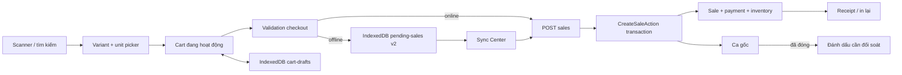

# Kế hoạch triển khai cải thiện màn hình POS

> Nguồn phân tích: [`docs/DANH-GIA-MAN-HINH-POS.md`](./DANH-GIA-MAN-HINH-POS.md)  
> Ngày lập kế hoạch: 16/08/2026  
> Trạng thái: Đang triển khai — P0 đến P1-04 và P2-01 đã hoàn thiện phần code; benchmark production, UAT/pilot Gate A và visual regression Gate C còn chờ kiểm tra thực tế  
> Phạm vi chính: POS, bán hàng, ca bán, catalog, offline queue và bản in 58 mm

### Cập nhật triển khai — 16/08/2026

- **P0-01:** Đã bổ sung Pest test cho quantity policy và offline sync/reconciliation; cần tiếp tục mở rộng matrix nghiệp vụ theo acceptance criteria.
- **P0-02:** Đã khóa shortcut destructive bằng confirm/undo và bổ sung validation tiền inline.
- **P0-03:** Đã bổ sung chọn variant/unit và chính sách số lượng nguyên/số lẻ ở client/server.
- **P0-04:** Đã hỗ trợ offline sync về ca gốc kể cả ca đã đóng, idempotency và cờ reconciliation.
- **P0-05:** Đã nâng IndexedDB lên envelope v2, Sync Center, retry/conflict và recovery export.
- **P0-06:** Đã triển khai receipt 58 mm, last receipt trong IndexedDB, reprint sau reload, receipt offline tạm và cập nhật receipt detail.
- **P0-07:** Đã triển khai shell `dvh/min-h-0`, scroll độc lập, focus ring, keyboard row selection, aria label/live region và cart overflow cục bộ.
- **P1-01:** Đã triển khai cart draft IndexedDB, active/held cart, autosave debounce/flush, restore sau reload, đổi tên, giữ/đổi/xóa đơn và giữ riêng checkout snapshot; PIN không lưu offline.
- **P1-02:** Đã triển khai tiền đủ/mệnh giá nhanh, tạo khách hàng nhanh qua JSON endpoint và cảnh báo tồn bằng text/icon; không chặn bán âm.
- **P1-03:** Đã khóa dialog mở ca khi chưa có ca, thêm CTA sang màn hình ca, polling riêng `activeShift`, hiển thị quầy/người mở/thời điểm mở và test contract một ca mở mỗi quầy.
- **Chưa đóng Gate A:** UAT Chrome/scanner theo ma trận viewport và hardware gate máy in thật vẫn cần thực hiện.
- **Chưa đóng P1-01/P1-02/P1-03:** UAT tối thiểu 5 cart, recovery, customer/debt, shift polling và pilot timing vẫn cần thực hiện.

**Kiểm chứng gần nhất:** `npm run lint:check`, `npm run typecheck`, `npm run build`, Pint và nhóm Pest POS đều pass. Full Pest hiện còn 3 test legacy fail do `/register` không tồn tại và `/` redirect về dashboard; không liên quan thay đổi POS.

**Kiểm chứng bổ sung — 17/08/2026:** Nhóm regression P1-03/P1-02/POS pass: 11 tests, 73 assertions; route `customers.quick.store` và partial polling `activeShift` đã kiểm tra.

## 1. Mục tiêu

Đưa màn hình POS từ trạng thái có thể pilot có giám sát sang trạng thái đủ an toàn để nhân viên sử dụng hằng ngày trên máy quầy, ưu tiên theo thứ tự:

1. Không làm mất giỏ hoặc ghi nhận sai giao dịch do phím tắt, validation hay chọn nhầm variant/unit.
2. Hóa đơn offline luôn có trạng thái rõ ràng, đồng bộ đúng một lần và vẫn thuộc ca gốc nếu ca đó đã đóng.
3. Quy tắc số lượng được kiểm soát ở cả giao diện và server: đơn vị đóng gói chỉ nhận số nguyên; đơn vị cân/đo được cấu hình mới nhận số lẻ.
4. Luồng bán hàng nhanh, dùng bàn phím tốt, giữ được nhiều đơn và phục hồi được sau reload/crash.
5. Hoạt động ổn định với gần 3.000 sản phẩm trên Chrome và các độ phân giải desktop phổ biến.
6. Hóa đơn 58 mm đọc rõ, in và in lại có kiểm soát trên thiết bị thật.

## 2. Điều kiện đã chốt

| Chủ đề | Quyết định dùng để triển khai |
|---|---|
| Thiết bị chính | Desktop 1920×1080, bàn phím, không cảm ứng |
| Màn hình hồi quy | 1600×900, 1536×864, 1440×900, 1366×768 và 1280×720, Chrome zoom 100% |
| Trình duyệt | Google Chrome |
| Scanner | Gửi phím `Enter` sau barcode |
| Ca bán | Hiện có một máy POS và một ca mở dùng chung tại chi nhánh |
| Offline qua ranh giới ca | Sale offline ghi về ca gốc; nếu ca gốc đã đóng thì ca đó được đánh dấu cần đối soát lại |
| Nhiều variant | Một sản phẩm có thể có nhiều variant; không được mặc định lấy `variants[0]` |
| Số lượng | Unit đóng gói như thùng chỉ nhận số nguyên; `1 thùng + 12 lon` là hai dòng hàng riêng |
| Số lượng lẻ | Chỉ unit được cấu hình cho phép số lẻ, ví dụ kg/lít |
| Tồn âm | Cho phép bán, nhưng phải cảnh báo rõ |
| Giữ đơn | Có nhu cầu giữ nhiều đơn/cart draft |
| In | Không tự động in; nhân viên chủ động in hoặc in lại |
| Máy in | Model/driver chưa xác định; phải hoàn tất UAT phần cứng trước cutover |
| Quy mô catalog | Gần 3.000 sản phẩm; số variant/unit/barcode chính xác được đo lại sau migration cuối |

Không còn câu hỏi nghiệp vụ nào chặn thiết kế. Thông tin máy in và Windows display scaling là dữ liệu UAT cần bổ sung, không phải blocker để bắt đầu phát triển.

## 3. Phạm vi và nguyên tắc triển khai

### 3.1. Trong phạm vi

- Sửa an toàn phím tắt và focus scanner.
- Sửa chọn variant/unit và áp chính sách số lượng.
- Bổ sung trạng thái, retry, lỗi và recovery cho offline queue.
- Cho phép đồng bộ sale offline về ca gốc đã đóng với audit/reconciliation.
- Validation tiền ngay tại trường nhập.
- Cải thiện receipt 58 mm và luồng in lại.
- Responsive desktop, keyboard navigation và accessibility.
- Nhiều cart draft, tự lưu và phục hồi.
- Tối ưu cash checkout, tạo nhanh khách hàng, trạng thái tồn kho.
- Benchmark catalog gần 3.000 sản phẩm.

### 3.2. Ngoài phạm vi giai đoạn hardening

- Không viết lại toàn bộ POS hoặc đổi framework.
- Không thêm chế độ mobile-first hay touch-first.
- Không tự động in sau thanh toán.
- Không xây hệ thống đồng bộ hai chiều tổng quát.
- Không thêm loyalty, promotion engine hoặc AI recommendation.
- Không thay dependency frontend nếu chưa có phê duyệt riêng.
- Không gộp nhiều unit thành một dòng vì sẽ làm sai giá và audit tồn kho.

### 3.3. Nguyên tắc kỹ thuật

- `resources/js/pages/pos/index.tsx` chỉ làm nhiệm vụ phối hợp state và layout; logic nghiệp vụ nằm trong `resources/js/features/pos`.
- Dữ liệu ban đầu tiếp tục dùng Inertia; thao tác bán hàng/sync tiếp tục dùng JSON API để kiểm soát lỗi theo từng field.
- Backend dùng Form Request cho validation, Action cho nghiệp vụ và transaction/row lock cho sale, shift, payment, inventory.
- Mọi kiểm tra quan trọng phải có ở server; validation frontend chỉ giúp phản hồi nhanh.
- Migration phải cộng thêm cột, có default an toàn và tương thích client cũ trong quá trình rolling deploy.
- IndexedDB upgrade không xóa store hay pending sale cũ.
- Dùng component và token sẵn có; không tạo UI primitive trùng lặp.
- Dùng Tailwind CSS v4 container queries cho hai panel POS, kết hợp breakpoint viewport cho khung trang.

## 4. Kiến trúc đích



### 4.1. Ranh giới module dự kiến

| Khu vực | Trách nhiệm |
|---|---|
| `pages/pos/index.tsx` | Ghép catalog, active cart, checkout, status bar và dialog; không chứa thuật toán sync/validation |
| `features/pos/model` | Type, selector và pure validation cho cart/tiền/số lượng |
| `features/pos/api` | JSON API, IndexedDB repositories, serialize/upgrade và sync |
| `features/pos/hooks` | Quản lý carts, scanner focus, shortcut, checkout và sync state |
| `features/pos/components` | Catalog, picker, cart, checkout, Sync Center, receipt và shortcut help |
| Form Requests | Kiểm tra cấu trúc payload, quyền, conditional rules và field errors |
| Actions | Sale transaction, offline closed-shift policy và shift reconciliation |
| Models/migrations | Lưu quantity policy, sync timestamps và reconciliation state |

## 5. Hợp đồng dữ liệu cần bổ sung

### 5.1. Chính sách số lượng theo unit

Thêm vào `product_units`:

| Cột | Kiểu dự kiến | Mặc định | Ý nghĩa |
|---|---|---|---|
| `allows_fractional_quantity` | boolean | `false` | Chỉ unit cân/đo được bật mới nhận quantity thập phân |

Quy tắc:

- `false`: quantity phải lớn hơn 0 và là số nguyên.
- `true`: quantity lớn hơn 0, tối đa 6 chữ số thập phân để phù hợp `decimal(18,6)` hiện tại.
- UI lấy policy từ đúng `product_unit`, đặt `step=1` hoặc `step=0.001`, nhưng server vẫn là nguồn quyết định cuối cùng.
- Dữ liệu cũ được backfill `false`; trước khi bật enforcement production phải rà và đánh dấu các unit kg/lít đang dùng.
- Import catalog và form quản lý sản phẩm phải cùng hỗ trợ trường này.

Các file chính dự kiến thay đổi:

- migration mới trong `database/migrations`;
- `app/Models/ProductUnit.php`;
- `app/Http/Requests/StoreProductRequest.php`;
- action lưu sản phẩm hiện tại;
- `resources/js/features/products/model/types.ts`;
- `resources/js/features/products/components/product-units-editor.tsx`;
- `app/Http/Controllers/PosController.php`;
- `resources/js/features/pos/model/types.ts`;
- `app/Http/Requests/StoreSaleRequest.php` và `app/Actions/Sales/CreateSaleAction.php`.

### 5.2. Sale offline và thời điểm phát sinh

Mở rộng payload sale:

```text
source = online | offline_sync
occurred_at = ISO-8601 do client ghi khi nhân viên xác nhận thanh toán
queued_at = ISO-8601 do client ghi khi lưu IndexedDB
idempotency_key = UUID giữ nguyên qua mọi lần retry
shift_id = ca đang hoạt động tại thời điểm phát sinh sale
```

Quy tắc server:

- Sale online vẫn yêu cầu ca đang mở và dùng thời gian server.
- `offline_sync` được phép ghi vào ca gốc đang mở hoặc đã đóng, nhưng ca phải thuộc đúng chi nhánh của user.
- Khi ca đã đóng, `occurred_at` phải từ `opened_at` đến `closed_at` với sai số đồng hồ cho phép 5 phút; trường hợp ngoài khoảng trả về conflict có mã lỗi rõ, không tự chuyển sang ca mới.
- `sales.sold_at` biểu diễn thời điểm sale phát sinh; `sales.created_at` là thời điểm server ghi nhận.
- Thêm `sales.synced_at` nullable; chỉ set khi nhận `offline_sync` để audit độ trễ.
- Idempotency key không đổi khi retry; cùng key khác payload bị từ chối như hiện tại.
- Không sửa `shift_id` sang ca mới.

Lưu ý trước khi code: sai số 5 phút là guard kỹ thuật đề xuất. Trong pilot phải kiểm tra đồng hồ Windows được đồng bộ; nếu thực tế có độ lệch lớn hơn thì điều chỉnh cấu hình, không hard-code thêm ở nhiều nơi.

### 5.3. Đối soát lại ca đã đóng

Thêm vào `shifts`:

| Cột | Kiểu dự kiến | Mục đích |
|---|---|---|
| `needs_reconciliation` | boolean, default `false`, index | Báo ca đóng có giao dịch đến muộn |
| `reconciled_at` | datetime nullable | Thời điểm xác nhận đã đối soát |
| `reconciled_by` | foreign key user nullable | Người xác nhận |
| `reconciliation_note` | text nullable | Ghi chú xử lý chênh lệch |

Khi một sale offline tiền mặt được ghi về ca đã đóng, trong cùng transaction:

1. Recompute `expected_cash` từ payment và cash movement của ca.
2. Recompute `difference_cash = actual_cash - expected_cash`.
3. Set `needs_reconciliation = true`.
4. Clear `reconciled_at`, `reconciled_by` và ghi audit context của sale đến muộn.

Màn hình ca phải có badge “Cần đối soát”, lọc được các ca này và action xác nhận đối soát kèm ghi chú. Không mở lại ca và không sửa `actual_cash` ban đầu.

### 5.4. IndexedDB v2

Nâng `marthub-pos` từ version 1 lên version 2, giữ nguyên và migrate dữ liệu:

```text
pending-sales:
  idempotency_key
  payload
  status = pending | syncing | failed | conflict
  attempts
  created_at
  updated_at
  last_attempt_at
  last_error_code
  last_error_message

cart-drafts:
  id
  name
  payload
  created_at
  updated_at
  is_active

catalog:
  giữ tương thích store hiện tại
```

Yêu cầu upgrade:

- Record v1 dạng payload thuần phải được đọc và chuẩn hóa thành envelope v2.
- Không xóa pending sale nếu request lỗi.
- Chỉ xóa sau response thành công hoặc idempotent replay trả về sale hợp lệ.
- `failed` cho lỗi có thể retry; `conflict` cho lỗi cần người xử lý.
- Cho phép xuất JSON recovery chứa pending records và metadata lỗi; không chứa owner PIN.

## 6. Thứ tự triển khai và dependency

```text
P0-01 Baseline
  ├─ P0-02 Shortcut + validation tiền
  ├─ P0-03 Variant/unit + quantity policy
  └─ P0-04 Offline contract backend
        └─ P0-05 IndexedDB v2 + Sync Center
P0-03 + P0-05 ── P0-06 Receipt + reprint
P0-02 + P0-03 ── P0-07 Responsive + keyboard/accessibility
Gate A đạt ────── P1-01 Multi-cart/draft
                  P1-02 Cash/customer/tồn kho
                  P1-03 Shift UX
                  P1-04 Benchmark catalog
Gate B đạt ────── P2-01 Visual tokens/dark mode
```

Không nên làm multi-cart trước khi hoàn tất IndexedDB v2 vì sẽ phải migrate client storage hai lần.

## 7. Kế hoạch ticket chi tiết

## Gate A — An toàn trước production

### P0-01 — Khóa baseline và bộ test nghiệp vụ POS

**Mục tiêu:** Có lưới an toàn trước khi sửa luồng bán hàng.

**Cách làm:**

- Ghi nhận payload/response hiện tại của sale online và offline.
- Bổ sung Pest feature tests cho: sale thành công, idempotent replay, cùng key khác payload, QR chưa xác nhận, debt không có customer, override offline, tồn âm và ca sai chi nhánh.
- Tạo fixture nhiều variant, nhiều unit, barcode riêng cho lon/lốc/thùng.
- Giữ convention `test()` và `RefreshDatabase` đang dùng trong dự án.
- Nếu có script smoke POS hiện hữu, chỉ mở rộng cho happy path; Pest vẫn là nguồn kiểm chứng chính.

**File dự kiến:**

- `tests/Feature/PosSaleFeatureTest.php`;
- `tests/Feature/PosOfflineSyncFeatureTest.php`;
- các factory/helper test hiện có nếu cần.

**Nghiệm thu:**

- Test mô tả đúng hành vi hiện tại trước refactor.
- Không có test phụ thuộc thứ tự chạy hoặc dữ liệu seed production.
- Chạy riêng nhóm test POS ổn định nhiều lần.

**Kiểm tra:** `php artisan test --compact tests/Feature/PosSaleFeatureTest.php tests/Feature/PosOfflineSyncFeatureTest.php`

**Rollback:** Chỉ thêm test, có thể revert độc lập; không thay đổi runtime.

### P0-02 — Phím tắt an toàn và validation tiền inline

**Mục tiêu:** Không xóa nhầm cart và không để nhân viên gửi dữ liệu tiền rõ ràng không hợp lệ.

**Cách làm:**

- Trong `use-pos-shortcuts.ts`, bỏ qua shortcut phá hủy khi target là `input`, `textarea`, `select`, `contenteditable` hoặc dialog đang mở.
- `Delete` chỉ xóa dòng đang được chọn rõ ràng; không có selection thì không làm gì.
- `F8` mở confirm bằng Dialog hiện có; nếu cart rỗng thì không hiện.
- Sau clear thành công hiển thị action Undo ngắn hạn từ snapshot trong memory.
- Định nghĩa shortcut tập trung thay vì khai báo rải rác.
- Validate discount không âm/không vượt line gross, cash/QR là integer không âm, QR không vượt total, debt bắt buộc customer và QR cần manual confirmation.
- Hiển thị lỗi cạnh đúng trường nhập; summary phía trên chỉ tổng hợp, không thay thế field error.
- Disable thanh toán khi invalid hoặc đang submit; server error map về field tương ứng.

**File dự kiến:**

- `resources/js/features/pos/hooks/use-pos-shortcuts.ts`;
- `resources/js/features/pos/model/validation.ts`;
- `resources/js/features/pos/hooks/use-pos-checkout.ts`;
- `resources/js/features/pos/components/cart-table.tsx`;
- component checkout/summary liên quan;
- `resources/js/pages/pos/index.tsx` chỉ cập nhật wiring.

**Nghiệm thu:**

- Nhấn `Delete`, `F8`, `Enter` trong mọi ô nhập không làm mất dữ liệu ngoài ý muốn.
- Clear cart cần xác nhận và có Undo.
- Không gửi request khi tiền không hợp lệ.
- Field lỗi đầu tiên được focus sau submit thất bại.

**Kiểm tra:** `npm run format:check`, `npm run lint:check`, `npm run typecheck`, `npm run build`; chạy checklist keyboard tại Gate A.

**Rollback:** Revert hook/component; không có thay đổi schema.

### P0-03 — Chọn đúng variant/unit và áp chính sách số lượng

**Mục tiêu:** Không mặc định variant đầu tiên và không cho nhập `1,5 thùng`.

**Cách làm backend:**

- Tạo migration thêm `product_units.allows_fractional_quantity` với default `false`.
- Cập nhật ProductUnit model, request lưu product và action lưu product.
- Cập nhật `PosController` trả policy cho catalog.
- Trong `StoreSaleRequest`/`CreateSaleAction`, load đúng ProductUnit rồi reject fractional quantity nếu policy tắt.
- Trả lỗi theo `items.{index}.quantity` để frontend đánh dấu đúng dòng.
- Thêm trường cho luồng import để kg/lít có thể được gán đúng sau migration; giá trị thiếu mặc định `false`.

**Cách làm frontend:**

- Exact barcode tiếp tục add thẳng đúng product/variant/unit đã map.
- Click card hoặc text-search Enter:
  - nếu chỉ có một tổ hợp variant/unit bán được: add thẳng;
  - nếu có nhiều lựa chọn: mở picker, hỗ trợ phím mũi tên/Enter/Escape;
  - ưu tiên unit default trong từng variant nhưng không tự chọn variant đầu tiên.
- Cart line hiển thị đủ product, variant và unit.
- Quantity input dùng step phù hợp, chặn số lẻ đóng gói và không ép ô trống thành `0.001`.
- Cho phép cùng variant có hai dòng `thùng` và `lon`; key vẫn theo `variant-unit`.
- Hiển thị cảnh báo tồn thấp/hết/âm nhưng không block bán.

**File dự kiến:**

- migration, `ProductUnit.php`, `StoreProductRequest.php`, action lưu product;
- `PosController.php`, `StoreSaleRequest.php`, `CreateSaleAction.php`;
- product types/form/unit editor;
- POS types, catalog search, catalog panel, cart table;
- component mới `variant-unit-picker.tsx`.

**Nghiệm thu:**

- Barcode lon, lốc, thùng add đúng unit tương ứng.
- Sản phẩm nhiều variant không bao giờ âm thầm chọn `variants[0]`.
- `1,5 thùng` bị từ chối ở client và server.
- `1 thùng + 12 lon` tạo hai dòng, áp hai giá và trừ tồn quy đổi đúng.
- Unit kg được bật fractional bán được `1,5 kg`.

**Test:**

- `tests/Feature/ProductQuantityPolicyFeatureTest.php`;
- mở rộng `PosSaleFeatureTest.php` cho integer/fractional và hai unit;
- `npm run check`.

**Rollback:** Migration có thể rollback trước khi có dữ liệu phụ thuộc; frontend cũ bỏ qua field mới. Nếu đã rollout dữ liệu, ưu tiên forward-fix và giữ cột để không mất cấu hình.

### P0-04 — Contract backend cho offline qua ca đã đóng

**Mục tiêu:** Sale offline đồng bộ đúng ca gốc, đúng một lần và tạo trạng thái đối soát minh bạch.

**Cách làm:**

- Tạo migration thêm `sales.synced_at` và các cột reconciliation của `shifts`.
- Mở rộng `StoreSaleRequest` với `occurred_at`, `queued_at` theo source.
- Tách logic tìm/khóa shift thành một phương thức hoặc Action chuyên biệt để tránh `CreateSaleAction` phình to.
- Online chỉ chấp nhận ca mở; offline sync chấp nhận ca mở/đóng theo contract thời gian và chi nhánh.
- Dùng `sold_at=occurred_at` cho offline, `synced_at=now()`; payment `paid_at` theo thời điểm sale phát sinh.
- Sau khi ghi payment vào ca đã đóng, gọi action tính lại expected/difference và đánh dấu cần đối soát trong cùng transaction.
- Tạo endpoint xác nhận đối soát dùng Form Request, authorization và audit rõ.
- Idempotent replay không được tính lại tiền/stock hoặc đánh dấu audit lặp.
- Chuẩn hóa mã lỗi JSON: `SHIFT_CLOSED_CONFLICT`, `OCCURRED_AT_OUT_OF_RANGE`, `QUANTITY_POLICY`, `VALIDATION_ERROR`, `IDEMPOTENCY_CONFLICT`.

**File dự kiến:**

- migrations mới;
- `app/Models/Sale.php`, `app/Models/Shift.php`;
- `app/Http/Requests/StoreSaleRequest.php`;
- `app/Actions/Sales/CreateSaleAction.php`;
- action mới `app/Actions/Shifts/RecalculateShiftTotalsAction.php`;
- request/action/controller/route xác nhận đối soát;
- shift resource/props và UI sau đó ở P1-03.

**Nghiệm thu:**

- Sale offline trước lúc đóng ca sync thành công sau khi ca đã đóng.
- Sale vẫn mang `shift_id` ca gốc và không rơi sang ca mới.
- Tồn, payment, công nợ chỉ ghi một lần khi retry.
- Expected/difference của ca được tính lại; ca có cờ cần đối soát.
- Sale online vào ca đóng vẫn bị từ chối.
- Sale offline có thời điểm ngoài ca hoặc sai chi nhánh trở thành conflict, không tự sửa dữ liệu.

**Test:**

- `tests/Feature/PosOfflineSyncFeatureTest.php`;
- `tests/Feature/ShiftReconciliationFeatureTest.php`;
- chạy test sale, shift, inventory và customer credit liên quan.

**Rollback:** Deploy schema/server tương thích trước frontend. Khi đã nhận sale offline vào ca đóng, không rollback dữ liệu; dùng forward-fix. Có thể tắt nhánh nhận closed-shift bằng config khẩn cấp nếu phát hiện lỗi.

### P0-05 — IndexedDB v2, Sync Center và recovery

**Phụ thuộc:** P0-04.

**Mục tiêu:** Nhân viên biết từng sale offline đang ở đâu và có cách xử lý khi lỗi.

**Cách làm:**

- Nâng DB version và thêm envelope/status metadata như mục 5.4.
- Tách repository khỏi sync orchestrator; repository chỉ CRUD, orchestrator quản lý state/retry.
- Mỗi lần queue lưu `occurred_at`, `queued_at`, shift code và receipt snapshot tối thiểu để nhân viên nhận diện.
- Sync tuần tự để giảm tranh chấp inventory; có lock trong tab để tránh hai chu kỳ sync chạy cùng lúc.
- Retry tự động khi browser chuyển online; retry thủ công từng record hoặc tất cả record có thể retry.
- Không retry vòng lặp tức thời; dùng backoff và chỉ kích hoạt lại khi online/nhân viên yêu cầu.
- Sync Center hiển thị pending/syncing/failed/conflict bằng text + icon, số lần thử, lỗi cuối và thời điểm.
- Cho phép export JSON recovery; thao tác xóa record conflict phải có xác nhận và quyền phù hợp.
- Status bar chỉ hiển thị summary; chi tiết nằm trong dialog/sheet Sync Center.

**File dự kiến:**

- `offline-sale-repository.ts`;
- `offline-sale-sync.ts`;
- thay `use-connectivity.ts` bằng/evolve thành `use-offline-sale-sync.ts`;
- `pos-status-bar.tsx`;
- component mới `sync-center.tsx`;
- types và `pages/pos/index.tsx` wiring.

**Nghiệm thu:**

- Upgrade từ IndexedDB v1 giữ nguyên pending sales.
- Mất mạng trong lúc thanh toán vẫn queue được và hiển thị mã nhận diện.
- Online lại sync đúng một lần; lỗi không bị nuốt.
- Conflict giữ nguyên record và chỉ rõ hướng xử lý.
- Reload/browser crash không mất pending record.
- Export recovery tải được JSON không chứa PIN hoặc credential.

**Kiểm tra:** `npm run check`; manual test với Chrome DevTools Offline; backend Pest từ P0-04.

**Rollback:** Không downgrade IndexedDB. Code rollback phải vẫn đọc được envelope v2 hoặc release rollback giữ adapter tương thích; ưu tiên forward-fix.

### P0-06 — Receipt 58 mm, hóa đơn gần nhất và in lại

**Phụ thuộc:** P0-03 và P0-05.

**Mục tiêu:** Receipt hiển thị/in đúng nội dung và nhân viên có thể in lại sau khi success bar biến mất.

**Cách làm:**

- Chuẩn hóa một `SaleReceipt` view model dùng chung cho POS preview và trang chi tiết sale.
- Bản in gồm: cửa hàng/chi nhánh, số hóa đơn, ca, nhân viên, sold_at, product + variant + unit, quantity, đơn giá, discount, tổng, hình thức thanh toán, công nợ, tiền thừa và ghi chú cần thiết.
- CSS `@media print` chỉ in receipt; đặt width 58 mm, font/line-height dễ đọc, không để tên dài đè cột tiền.
- Nút In chỉ gọi `window.print()` sau hành động người dùng; không auto print.
- Lưu last successful receipt trong state và IndexedDB metadata để nút “Hóa đơn gần nhất / In lại” còn dùng sau khi banner ẩn hoặc reload.
- Sale offline được in bản tạm có nhãn “Chờ đồng bộ”; sau sync có thể in lại số hóa đơn server.

**Nghiệm thu phần mềm:**

- Preview và print view không lệch tổng tiền.
- Tên hàng/variant dài wrap đúng.
- Hóa đơn online, offline pending, debt, discount và hai unit hiển thị rõ.
- Có thể in lại hóa đơn gần nhất mà không tạo sale mới.

**Hardware gate bắt buộc:**

- Ghi model máy in, driver, khổ giấy và Chrome production.
- Test trên giấy thật: tên dài, `1,5 kg`, `1 thùng + 12 lon`, discount, debt, return và reprint.
- Chỉ đóng ticket/cutover khi không bị cắt nội dung và tổng tiền đọc rõ.

**File dự kiến:** receipt components, POS types, sales receipt, print styles/global CSS và IndexedDB last receipt metadata.

**Kiểm tra:** `npm run check` + UAT thiết bị thật.

**Rollback:** Có thể revert UI/CSS; không ảnh hưởng dữ liệu sale. Giữ đường dẫn trang sale để in lại dự phòng.

### P0-07 — Responsive desktop, keyboard và accessibility

**Mục tiêu:** Dùng ổn trên các desktop phổ biến mà không làm giảm tốc độ thao tác ở 1920×1080.

**Cách làm:**

- Đặt page shell theo `h-dvh/min-h-0`, kiểm soát vùng scroll độc lập cho catalog và cart.
- Dùng container queries cho số cột product card và mức chi tiết của cart theo bề rộng panel thực tế.
- Ở viewport hẹp, giảm số cột catalog, thu gọn metadata phụ và giữ checkout action luôn thấy; không dùng absolute positioning cho vùng chính.
- Kiểm tra sidebar mở/thu, checkout đóng/mở, cảnh báo offline, stale price và customer picker.
- Scanner focus mặc định ở search khi không có dialog; đóng dialog/đổi cart trả focus về search.
- Thiết lập thứ tự Tab, focus trap trong Dialog, Escape để đóng, Enter có hành vi theo context.
- Bổ sung `aria-label`, visible focus ring, live region cho scan success/error và sync state.
- Tạo bảng trợ giúp shortcut nhỏ từ cùng shortcut registry.

**Nghiệm thu:**

- Không có horizontal scroll toàn trang ở các viewport đã chốt.
- Nút thanh toán, tổng tiền và trạng thái mạng không bị cắt.
- Chỉ dùng bàn phím có thể scan/tìm, chọn variant/unit, sửa số lượng, chọn khách, thanh toán và đóng dialog.
- Screen reader nhận được lỗi field và thay đổi sync quan trọng.

**Kiểm tra:** `npm run check` + ma trận viewport/keyboard ở mục 9.

**Rollback:** Chia commit theo shell, catalog, cart, dialog để revert từng khu vực.

## Gate B — Tăng hiệu suất nhân viên

### P1-01 — Nhiều cart draft, giữ đơn và phục hồi

**Trạng thái triển khai:** Đã hoàn thiện vòng code; chờ UAT recovery/multi-cart theo acceptance criteria.

**Phụ thuộc:** Gate A, đặc biệt IndexedDB v2.

**Mục tiêu:** Phục vụ khách xen kẽ mà không mất đơn đang làm.

**Cách làm:**

- Xây `use-pos-carts.ts` quản lý danh sách draft và active cart; không nhân đôi logic tính totals.
- Auto-save debounce vào `cart-drafts`; flush khi `visibilitychange`/navigation phù hợp.
- Mỗi cart có tên ngắn, thời gian cập nhật, số dòng, tổng tạm tính và customer.
- Action: đơn mới, đổi đơn, đổi tên, giữ đơn, khôi phục và xóa có xác nhận.
- Sau sale thành công chỉ clear đúng active cart.
- Nếu reload, khôi phục carts và active cart; dữ liệu lỗi version/schema được cô lập, không làm POS trắng màn hình.
- Khi đổi cart, search được clear hợp lý và scanner focus quay lại ô tìm kiếm.

**File dự kiến:** `cart-draft-repository.ts`, `use-pos-carts.ts`, `held-carts-panel.tsx`, model selectors/types và wiring page.

**Nghiệm thu:**

- Có ít nhất 5 cart hoạt động ổn định trong một session.
- Chuyển cart không thay đổi dòng, customer hoặc payment draft của cart khác.
- Reload/crash khôi phục được cart chưa thanh toán.
- Thanh toán cart A không xóa cart B.

**Kiểm tra:** `npm run check` + UAT recovery/multi-cart.

### P1-02 — Tối ưu tiền mặt, khách hàng và cảnh báo tồn

**Trạng thái triển khai:** Đã hoàn thiện vòng code; chờ UAT quick cash, quick customer và pilot timing.

**Mục tiêu:** Giảm click và thời gian thanh toán trung bình.

**Cách làm:**

- Thêm action “Tiền đủ” và các mệnh giá nhanh dựa trên tổng cần thu; phím tắt không xung đột scanner.
- Hiển thị tiền thừa ngay khi nhập.
- Cho tạo nhanh khách hàng trong checkout bằng endpoint/form hiện có, sau thành công tự chọn customer vừa tạo.
- Giữ validation số điện thoại/tên và lỗi duplicate của backend.
- Trình bày tồn đủ/thấp/hết/âm bằng text/icon; không dựa chỉ vào màu và không block do policy bán âm.
- Đo thao tác trước/sau trong pilot.

**Nghiệm thu:**

- Cash sale phổ biến hoàn tất không cần nhập lại tổng tiền.
- Customer mới được tạo và gắn đúng sale debt.
- Không thể tạo debt nếu quick-create thất bại.
- Cảnh báo tồn không gây layout shift hoặc chặn scan.

**Kiểm tra:** Pest cho customer/debt + `npm run check` + pilot timing.

### P1-03 — Luồng ca/quầy và đối soát rõ ràng

**Trạng thái triển khai:** Đã hoàn thiện vòng code; chờ UAT không có ca, mở ca từ POS và polling thay đổi ca.

**Mục tiêu:** Không để nhân viên ở trạng thái cụt và làm rõ ca nào đang hoạt động.

**Cách làm:**

- Open-shift dialog không đóng được theo cách khiến POS không còn đường tiếp tục; nếu hủy, hiển thị trạng thái khóa bán với CTA mở ca/đi trang ca.
- Active shift props gồm register, opened_at và identity rõ.
- Poll/reload riêng prop active shift ở nhịp hợp lý để phát hiện thay đổi từ màn hình ca mà không tải lại catalog.
- Màn hình ca hiển thị badge/lọc “Cần đối soát”, sale đến muộn và số tiền expected/difference mới.
- Action xác nhận đối soát yêu cầu ghi chú nếu còn chênh lệch.
- Ghi rõ contract một ca mở mỗi quầy/chi nhánh trong validation và test, sẵn sàng cho mở rộng nhiều máy sau này.

**Nghiệm thu:**

- Không có ca: POS không bán nhưng luôn có hướng xử lý.
- Mở ca xong POS cập nhật mà không tải lại toàn catalog ngoài nhu cầu.
- Ca có sale offline đến muộn hiển thị rõ và đối soát được.
- Đối soát không sửa `actual_cash` lịch sử.

**Kiểm tra:** Pest shift/reconciliation + Inertia prop reload smoke + `npm run check`.

### P1-04 — Benchmark và tối ưu catalog gần 3.000 sản phẩm

**Mục tiêu:** Chứng minh scanner/search đủ nhanh trên máy quầy thật trước cutover.

**Trạng thái cập nhật (17/08/2026):** Đã hoàn thiện memo catalog search theo version product/variant/unit/barcode, giữ exact barcode Map, và đã xác nhận batch render 100 item/lazy image. Benchmark p50/p95 trên Chrome và máy quầy thật còn chờ UAT; chưa đóng P1-04.

**Cách làm:**

- Sau migration cuối, đo product, variant, unit, barcode và customer count bằng query read-only.
- Tạo dataset staging tương đương production, không dùng dữ liệu nhạy cảm.
- Đo: response size, initial render, build search index, input-to-paint, exact scan-to-cart p50/p95, số DOM nodes và long task.
- Giữ exact barcode Map; memoize index theo catalog version và tránh rebuild bởi callback/state không liên quan.
- Kiểm tra batch render/lazy image; nếu vẫn chậm mới cân nhắc virtualization hoặc chia catalog payload. Không tối ưu phỏng đoán trước khi có profile.
- Nếu dùng Inertia partial reload/polling, không reload catalog khi chỉ cập nhật active shift/status.

**Ngân sách hiệu năng ban đầu:**

- Exact barcode scan-to-cart p95 ≤ 100 ms trên máy quầy.
- Text input-to-paint p95 ≤ 150 ms.
- Không phát sinh long task > 200 ms trong lúc scan sau khi index đã sẵn sàng.
- Sau tối ưu, không regression quá 10% so với baseline ở các chỉ số khác.

**Nghiệm thu:** Báo cáo benchmark ghi máy, Chrome version, dataset count, p50/p95 trước/sau và bottleneck đã xử lý.

**Kiểm tra:** Chrome Performance/React profiling trên máy thật + `npm run build`; không dùng dev build để chốt số liệu.

## Gate C — Tinh chỉnh sau pilot

### P2-01 — Chuẩn hóa visual token và dark mode

**Mục tiêu:** Giảm style rời rạc sau khi luồng nghiệp vụ đã ổn định.

**Trạng thái cập nhật (17/08/2026):** Đã bổ sung semantic token `info`, `success`, `warning` cho light/dark theme và chuẩn hóa màu POS cho thông báo, tồn kho, thanh toán, trạng thái kết nối, công nợ và receipt toast. Visual regression tại viewport production còn chờ UAT.

**Cách làm:**

- Thay màu `slate/white/emerald/red` hard-code bằng semantic tokens (`background`, `foreground`, `muted`, `destructive`, trạng thái nghiệp vụ dùng token chung).
- Chuẩn hóa spacing, density, header/table/card/dialog theo design system hiện có.
- Kiểm tra contrast, focus ring và trạng thái hover/disabled.
- Chỉ hoàn thiện dark mode nếu POS thực sự bật theme; không để class tối nửa vời.

**Nghiệm thu:** Không làm thay đổi flow, kích thước click target hay hiệu năng đáng kể; visual regression được UAT lại tại viewport chính.

## 8. Chiến lược kiểm thử

### 8.1. Backend tự động bằng Pest

| Nhóm | Kịch bản bắt buộc |
|---|---|
| Sale cơ bản | cash, QR, mixed payment nếu hỗ trợ, debt, discount, owner approval |
| Idempotency | replay cùng payload; cùng key khác payload; retry sau timeout |
| Quantity | integer unit từ chối số lẻ; fractional unit chấp nhận; quantity ≤ 0 bị từ chối |
| Variant/unit | nhiều variant, nhiều unit, barcode riêng, hai unit cùng variant |
| Offline | ca mở; ca đóng; ca sai chi nhánh; occurred_at ngoài khoảng; sale online vào ca đóng |
| Reconciliation | expected/difference tính lại; cờ cần đối soát; xác nhận đối soát |
| Inventory | trừ đúng quantity_base; FEFO; cho phép tồn âm; retry không trừ hai lần |
| Payment/debt | paid_at/sold_at đúng; QR confirm; customer credit chỉ ghi một lần |
| Authorization | user khác organization/branch không đọc hoặc ghi được dữ liệu |

Chạy tối thiểu test liên quan sau mỗi ticket. Trước merge Gate A chạy toàn bộ `php artisan test --compact`.

### 8.2. Frontend programmatic checks

Project hiện chưa có frontend unit-test runner. Mỗi ticket frontend bắt buộc chạy:

```bash
npm run format:check
npm run lint:check
npm run typecheck
npm run build
```

Không tự thêm Vitest/React Testing Library trong kế hoạch này vì sẽ thay dependency. Nếu đội dự án phê duyệt riêng, nên thêm unit tests cho pure validation, IndexedDB migration adapter, sync state machine và cart reducers trước P1-01.

### 8.3. Regression bắt buộc

- Catalog/product management sau khi thêm quantity policy.
- Sale list/show/return sau khi đổi receipt và sold_at.
- Close shift/cash movements sau khi thêm reconciliation.
- Customer debt/credit sau sale offline.
- Service worker/cache nếu build mới thay asset manifest.

## 9. Ma trận UAT

### 9.1. Viewport và layout

Chạy Chrome zoom 100% tại 1920×1080 (gate chính), sau đó 1600×900, 1536×864, 1440×900, 1366×768 và 1280×720.

Tại mỗi viewport kiểm tra:

- sidebar mở và thu;
- catalog nhiều/ít ảnh;
- cart 1, 5 và 20 dòng;
- checkout mở/đóng;
- customer picker và dialog variant/unit;
- offline/stale price/sync conflict;
- không mất nút thanh toán hoặc tổng tiền.

### 9.2. Scanner và bàn phím

- Scan nhanh liên tiếp barcode hợp lệ, barcode không tồn tại và cùng barcode hai lần.
- Scanner có suffix Enter không kích hoạt nhầm nút/dialog.
- Scan lon/lốc/thùng của cùng sản phẩm.
- Text search + Enter với sản phẩm một và nhiều variant.
- Tab/Shift+Tab, Arrow, Enter, Escape, Delete và F8 trong/ngoài input.
- Đổi cart rồi scan; đóng dialog phải trả focus đúng.

### 9.3. Cart và checkout

- `1,5 thùng` bị từ chối; `1 thùng + 12 lon` đúng tiền/tồn.
- `1,5 kg` được chấp nhận khi unit được cấu hình.
- Discount bằng/nhỏ/lớn hơn line gross.
- Cash thiếu/đủ/thừa, QR vượt tổng, QR chưa xác nhận, sale debt không customer.
- Tồn đủ/hết/âm và cảnh báo tương ứng.
- Clear cart confirm/undo và reload phục hồi draft.

### 9.4. Offline và ca

- Mất mạng trước và trong lúc submit.
- Queue nhiều sale, reload browser, online lại và sync.
- Đóng ca cũ, mở ca mới, sync sale cũ vào đúng ca gốc.
- Retry cùng idempotency key sau timeout.
- Conflict do thời điểm ngoài ca/sai chi nhánh; export recovery.
- Ca cũ hiển thị cần đối soát, expected/difference mới và xác nhận đối soát.

### 9.5. Receipt và phần cứng

- Preview, in và in lại sale online.
- Bản tạm offline và bản server sau sync.
- Tên hàng/variant dài, số lượng lẻ, hai unit, discount, debt, return.
- Ghi nhận model máy in, driver, khổ giấy, Chrome version và Windows scaling.

## 10. Kế hoạch rollout

### Release A — Schema và server tương thích ngược

1. Backup database và xác nhận restore procedure.
2. Deploy các cột mới có default/nullable an toàn.
3. Deploy server hiểu payload mới nhưng vẫn nhận client cũ trong thời gian chuyển tiếp.
4. Backfill `allows_fractional_quantity=false`; rà danh sách unit kg/lít và bật đúng policy trước enforcement.
5. Chạy Pest và smoke sale/shift trên staging.

### Release B — POS Gate A

1. Deploy frontend variant/unit, shortcut, validation và IndexedDB v2.
2. Theo dõi error log, số pending/failed/conflict và idempotency conflict.
3. Pilot trên một máy quầy với dữ liệu gần production.
4. Hoàn tất UAT scanner và hardware print gate.
5. Chỉ cutover khi toàn bộ điều kiện Gate A đạt.

### Release C — Hiệu suất nhân viên

1. Multi-cart/draft.
2. Cash quick actions, quick customer và shift UX.
3. Benchmark catalog trên máy thật.
4. Pilot có đo thời gian thao tác và lỗi người dùng.

### Release D — Visual hardening

Chuẩn hóa token/dark mode sau khi số liệu pilot cho thấy luồng nghiệp vụ ổn định.

## 11. Điều kiện qua gate

### Gate A — Cho phép production

- Không còn shortcut phá hủy không confirm/undo.
- Multiple variant/unit và integer/fractional policy đúng ở client/server.
- Offline sync qua ca đóng đúng ca gốc, idempotent và có reconciliation.
- Sync Center hiển thị được lỗi/retry/recovery.
- Validation tiền inline đầy đủ.
- UAT Chrome 1920×1080, scanner Enter và ma trận desktop đạt.
- Bản in 58 mm đạt trên model/driver thật.
- Pest liên quan và `npm run check` đều pass.

### Gate B — Đạt hiệu suất vận hành

- Multi-cart/draft phục hồi ổn định.
- Cash/customer flow đạt UAT.
- Benchmark 3.000 sản phẩm nằm trong ngân sách.
- Pilot không có sale mất, sale trùng hoặc pending không giải thích được.

### Gate C — Hoàn thiện

- Visual token/accessibility nhất quán.
- Không regression nghiệp vụ hoặc hiệu năng sau tinh chỉnh.

## 12. Chỉ số cần theo dõi trong pilot

- Thời gian từ scan đầu tiên đến hoàn tất sale.
- Số click/phím trung bình cho cash sale và debt sale.
- Tỷ lệ barcode không tìm thấy/chọn lại variant-unit.
- Số lần clear cart rồi Undo.
- Số pending, failed, conflict; thời gian pending lâu nhất.
- Tỷ lệ sync thành công lần đầu và số idempotent replay.
- Số ca cần đối soát do sale đến muộn; tổng chênh lệch trước/sau.
- Tỷ lệ reprint và lỗi/cắt nội dung bản in.
- Search input-to-paint và scan-to-cart p50/p95.

Không log owner PIN, thông tin xác thực hoặc toàn bộ payload khách hàng vào browser/server log.

## 13. Rủi ro và biện pháp kiểm soát

| Rủi ro | Mức | Kiểm soát |
|---|---:|---|
| IndexedDB upgrade làm mất sale chờ | Rất cao | Migration adapter v1→v2, fixture dữ liệu cũ, không downgrade DB, export recovery |
| Retry tạo sale/stock/payment trùng | Rất cao | Giữ idempotency key, transaction, lock, Pest timeout/replay |
| Sale offline gắn sai ca | Rất cao | Không remap shift, kiểm tra branch/time range, audit và conflict rõ |
| Unit kg/lít bị mặc định integer | Cao | Báo cáo/backfill trước enforcement, UAT catalog thật |
| Recompute ca làm sai chênh lệch | Cao | Một action dùng chung, lock shift, test cash in/out/payment |
| Scanner Enter kích hoạt nhầm UI | Cao | Context guard, focus contract, UAT scanner thật |
| Catalog 3.000 sản phẩm gây lag | Trung bình | Baseline/profile, Map, memoization, batch/virtualize khi có bằng chứng |
| Print khác giữa driver | Cao | Hardware gate theo đúng model/driver/Chrome |
| Rollback frontend không đọc IDB v2 | Cao | Adapter tương thích ngược và forward-fix policy |
| Scope phình thành redesign | Trung bình | Triển khai theo vertical slice/ticket và gate nghiệm thu |

## 14. Definition of Done cho từng ticket

Một ticket chỉ được coi là hoàn tất khi:

1. Acceptance criteria được chứng minh.
2. Validation và authorization nằm ở đúng lớp server.
3. Không làm page component phình thêm logic nghiệp vụ không cần thiết.
4. Có Pest test cho backend thay đổi và chạy pass test liên quan.
5. Frontend pass format, lint, typecheck và production build.
6. Đã kiểm tra keyboard/focus/field errors cho UI thay đổi.
7. Migration có chiến lược dữ liệu cũ và rollout/rollback rõ.
8. Không ghi secret/PIN vào log, IndexedDB hoặc recovery export.
9. UAT evidence được đính kèm ticket nếu liên quan thiết bị hoặc viewport.
10. Tài liệu đánh giá/kế hoạch được cập nhật nếu quyết định nghiệp vụ thay đổi.

## 15. Thứ tự bắt đầu đề xuất

Sprint/đợt đầu nên lấy ba nhánh công việc sau, nhưng merge theo dependency:

1. **P0-01 → P0-04:** dựng test nền rồi hoàn thiện offline closed-shift/reconciliation.
2. **P0-01 → P0-03:** quantity policy và variant/unit picker.
3. **P0-01 → P0-02:** shortcut và validation tiền.

Sau khi ba nhánh trên ổn định, triển khai P0-05, P0-06 và P0-07 để đóng Gate A. Không bắt đầu P2 trước khi Gate B có dữ liệu pilot.
